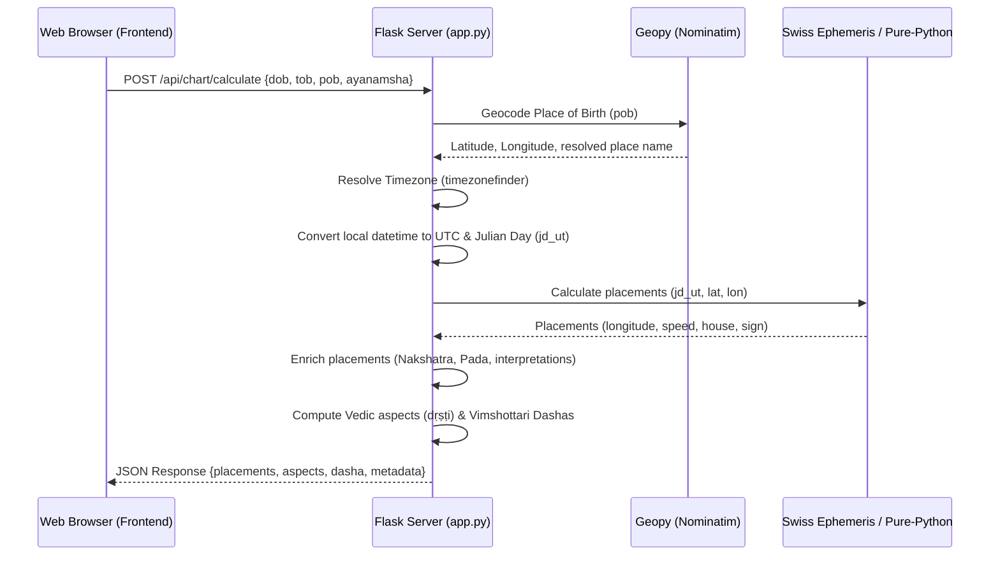

# Pratyabhijna (प्रत्यभिज्ञा) — Immersive Vedic Observatory

Pratyabhijna (Sanskrit for "recognition" or "remembrance") is an immersive, cinematic, Vedic-only astronomical and astrological (Jyotiṣa) observatory interface. It departs from standard, dry dashboard layouts to offer an occult, interactive, full-screen spiritual encounter centered on a circular sidereal sky mandala.

---

## 🌌 Core Features

1. **CesiumJS Cosmic Entry**: A cinematic 3D Earth globe that starts in deep space. When birth details are entered, the camera flies to the geocoded birth coordinates, spawns a sacred golden marker and a cyan light beam, and then fades out into the mandala.
2. **Sequential Cinematic Staging**: During coordinate calculations, the UI triggers staging titles ("Scorpio Lagna rises...", "Nakshatras calculated...", "Grahas settling...") to build anticipation.
3. **Cosmic Settling Transition**: On load, planetary nodes start from deep space orbits (random radii and angles) and transition smoothly (using CSS transitions) into their exact sidereal longitudes.
4. **Interactive Jyotiṣa Mandala**:
   - Renders 12 Sanskrit rāśis (Meṣa through Mīna) and 27 stellar Nakshatras.
   - Dynamic Rahu-Ketu karmic axis (glowing rose axis line).
   - Collision-avoidance spacing that staggers the radius of planets occupying the same house or sign.
   - Interactive hover cards and click-locks for planets (grahas) and aspects.
5. **Six Visual Modes**:
   - **Rāśi (Default)**: Visualizes the 12 signs, houses, and planet placements.
   - **Nakshatra**: Highlights the 27 stellar divisions and dims Rashis.
   - **Aspects**: Draws structural geometric Vedic aspects (dṛṣṭi) between planets and houses.
   - **Gochar (Transit)**: Overlays current planetary positions calculated at UTC now.
   - **Dasha**: Visualizes Vimshottari Dasha cycles on a temporal timeline.
   - **Table**: Shows exact calculations (degrees, nakshatras, padas, lords).
6. **Oracle Chat Panel**: A glassmorphic console that accepts text queries (e.g. "Moon", "Saturn", "aspects") to focus the mandala, trigger modes, and describe spiritual themes.
7. **Celestial Keyboard Shortcuts**:
   - `/`: Focus Oracle Chat
   - `M`: Focus Moon
   - `S`: Focus Saturn
   - `R`: Focus Rahu
   - `K`: Focus Ketu
   - `A`: Toggle Aspect mode
   - `N`: Toggle Nakshatra mode
   - `T`: Toggle Gochar/Timeline mode
   - `Esc`: Reset focus and view modes

---

## ⚙️ Technical Architecture & Data Flow



### 1. Backend Layer (`python`)
- **Flask Server (`app.py`)**: Defines routes, processes calculation requests, serves the Oracle backend, and handles fallback logic if API services or calculations fail.
- **Geocoding & Timezones**:
  - `pratyabhijna/geocode.py`: Geocodes places using `geopy` (Nominatim) with an in-memory cache for common locations (`Kathmandu`, `Wichita`, `Ujjain`).
  - `pratyabhijna/time_utils.py`: Resolves timezones with `timezonefinder` and converts local time to UTC and Julian Day.
- **Ephemeris Calculations (`pratyabhijna/ephemeris.py`)**:
  - Tries Swiss Ephemeris (`pyswisseph`) first for high-accuracy calculations.
  - Falls back to `pratyabhijna/pure_ephem.py` (a pure-Python geocentric model using VSOP87/Meeus algorithms) if binary packages are unavailable.
- **Vedic Calculations (`pratyabhijna/vedic.py` / `pratyabhijna/jyotisha.py`)**:
  - Maps longitudes to 12 signs (Rāśis) and 27 Nakshatras.
  - Computes whole-sign houses relative to the Lagna.
- **Vedic Aspects (`pratyabhijna/aspects.py`)**:
  - Computes conjunctions (grahas sharing a house).
  - Computes dṛṣṭi (standard 7th aspect, special aspects for Mars, Jupiter, Saturn, Rahu, and Ketu).
- **Dasha Engine (`pratyabhijna/dasha.py`)**:
  - Calculates the Vimshottari Dasha (120-year cycle) starting lord and balance at birth.
- **Interpretations (`pratyabhijna/interpretations.py`)**:
  - Generates dynamic texts for placements.

### 2. Frontend Layer (`HTML / CSS / JS`)
- **CesiumJS Globe (`static/js/cesiumEarthScene.js`)**:
  - Renders a 3D dark-styled rotating Earth.
  - Transitions to a fly-in zoom, displays pulsing rings, and fades away on mandala reveal.
- **Interactive Mandala SVG (`static/js/app.js`)**:
  - Dynamically draws SVG circles, radial sectors, aspect lines (curved arcs), and node markers.
  - Implements collision-avoidance staggering to move overlapping planets inward or outward.
  - Implements the Oracle command interpreter, keyboard shortcuts, and responsive panels.
- **Styling (`static/css/style.css`)**:
  - Dark mode with glassmorphic cards, cyan glows, and typography based on Google Fonts (`Cinzel` for headers, `Inter` for body).

---

## 📁 Directory Structure

```text
PRATYABHIJNA/
│
├── app.py                      # Main Flask web application & API endpoints
├── requirements.txt            # Python backend dependencies
├── README.md                   # Project documentation & Edit Log (this file)
│
├── pratyabhijna/               # Vedic Jyotisha Engine (Python modules)
│   ├── __init__.py             # Package declaration
│   ├── data.py                 # Static D1 fallback data
│   ├── jyotisha.py             # Basic calculations & metadata enrichment
│   ├── pure_ephem.py           # Pure-Python planetary calculations (fallback)
│   ├── ephemeris.py            # Unified Swiss Ephemeris vs. Pure-Python selector
│   ├── time_utils.py           # Time conversion, Julian Day, & timezone resolution
│   ├── geocode.py              # Geocoding wrapper using Geopy
│   ├── aspects.py              # Vedic aspects (dṛṣṭi) and conjunctions logic
│   ├── dasha.py                # Vimshottari Dasha calculation engine
│   ├── interpretations.py      # Dynamic interpretation generator
│   └── vedic.py                # Core constants (signs, nakshatras, lords, glyphs)
│
├── templates/
│   └── index.html              # HTML markup, SVG overlays, and CDN imports
│
└── static/                     # Frontend static assets
    ├── css/
    │   └── style.css           # Styling (Glassmorphism, glows, layout)
    └── js/
        ├── app.js              # SVG rendering, collision-avoidance, hotkeys, Oracle
        ├── aspects.js          # Predefined visual aspect configurations
        ├── cesiumEarthScene.js # CesiumJS 3D Earth rendering and fly-to animation
        └── earthScene.js       # Three.js old procedural earth scene (unused backup)
```

---

## 🚀 Getting Started

### 1. Install Dependencies
```bash
pip install -r requirements.txt
```
*Note: Swiss Ephemeris (`pyswisseph`) is optional. If it fails to compile/install, the application will automatically fall back to the built-in pure-Python ephemeris module.*

### 2. Start the Server
```bash
python app.py
```

### 3. Open the Application
Navigate to `http://127.0.0.1:5000/` in your browser.

---

## 📝 Edit History & Version Log

Every edit to the project documentation or codebase must be recorded below with a timestamp, version number, and description of the changes made.

| Version | Timestamp | Description of Changes |
| :--- | :--- | :--- |
| v1.0.0 | 2026-06-25T00:15:00-05:00 | Initial comprehensive project analysis, architecture documentation, directory structure description, and context dump. |
| v1.1.0 | 2026-06-25T00:26:33-05:00 | Upgraded the Pratyabhijna chart UI for a Western premium audience (English zodiac labels primarily, secondary Sanskrit names, visual hierarchy updates, responsive upgrades, bottom control renaming, and side interpretation panel). |
| v1.2.0 | 2026-06-25T00:43:00-05:00 | Upgraded Pratyabhijna chart to a full-screen observatory: widened concentric ring radii, scaled up the chart container dynamically to `min(92vw, 92vh)` across viewports, added support for `aspect` and `aspect_list` within the info panel with interactive focus controls, implemented mobile slide-up bottom sheets for `.infoPanel`, `.nakSummary` and `.command` modules, and optimized touch targets to meet 44px height standards with wrapping controls. |
| v1.2.1 | 2026-06-25T00:50:00-05:00 | Centered chart/mandala absolutely on desktop and tablet viewports relative to the entire screen, allowing the right-hand panel, bottom controls (timeline, modes, aspect-filters), and status indicators to float gracefully as overlays. |
| v1.2.2 | 2026-06-25T01:05:00-05:00 | Upgraded planet nodes to glowing, 3D-shaded celestial bodies with 48px hit targets across viewports, implemented conjunction staggered clustering with dotted exact-longitude tethers, added hover/click conjunction expansions with a bottom-sheet panel listing members, and resolved aspect line click/hover ambiguities by enabling pointer-events stroke on the aspect hit targets and ignoring background sector hovers while focused. |
